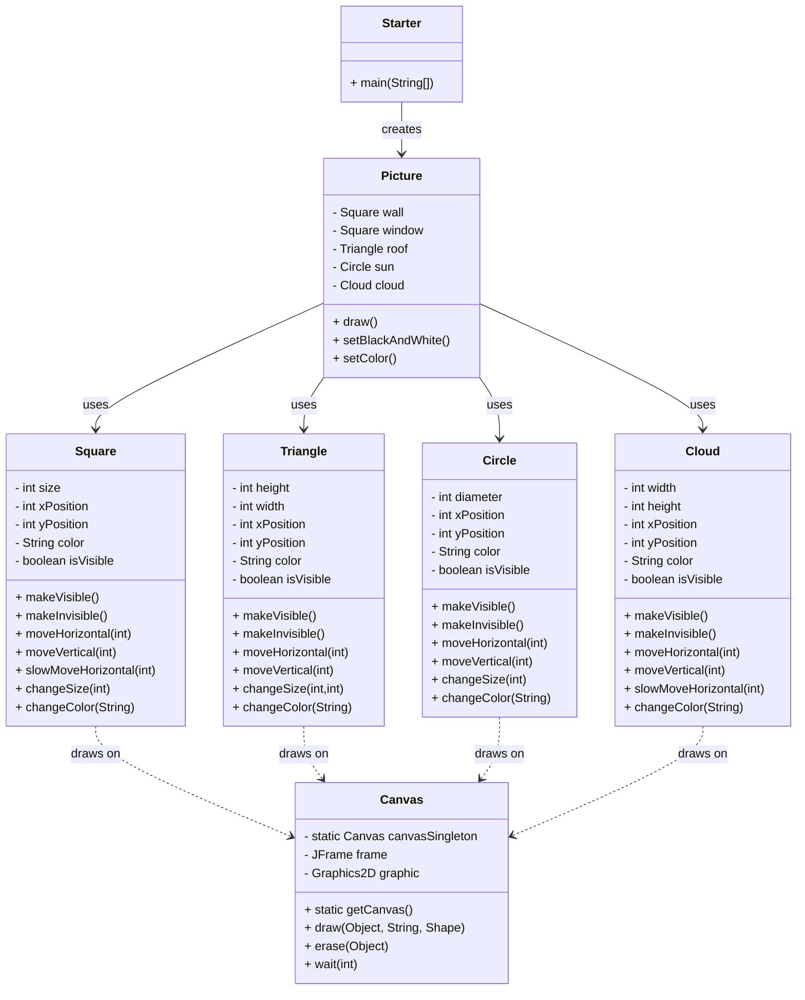

# UML-Diagramm (Mermaid) — V2 Haus Picture

```mermaid
classDiagram
    class Picture {
        - Square wall
        - Square window
        - Triangle roof
        - Circle sun
        - Cloud cloud
        + draw()
        + setBlackAndWhite()
        + setColor()
    }

    class Square {
        - int size
        - int xPosition
        - int yPosition
        - String color
        - boolean isVisible
        + makeVisible()
        + makeInvisible()
        + moveHorizontal(int)
        + moveVertical(int)
        + slowMoveHorizontal(int)
        + changeSize(int)
        + changeColor(String)
    }

    class Triangle {
        - int height
        - int width
        - int xPosition
        - int yPosition
        - String color
        - boolean isVisible
        + makeVisible()
        + makeInvisible()
        + moveHorizontal(int)
        + moveVertical(int)
        + changeSize(int,int)
        + changeColor(String)
    }

    class Circle {
        - int diameter
        - int xPosition
        - int yPosition
        - String color
        - boolean isVisible
        + makeVisible()
        + makeInvisible()
        + moveHorizontal(int)
        + moveVertical(int)
        + changeSize(int)
        + changeColor(String)
    }

    class Cloud {
        - int width
        - int height
        - int xPosition
        - int yPosition
        - String color
        - boolean isVisible
        + makeVisible()
        + makeInvisible()
        + moveHorizontal(int)
        + moveVertical(int)
        + slowMoveHorizontal(int)
        + changeColor(String)
    }

    class Canvas {
        - static Canvas canvasSingleton
        - JFrame frame
        - Graphics2D graphic
        + static getCanvas()
        + draw(Object, String, Shape)
        + erase(Object)
        + wait(int)
    }

    class Starter {
        + main(String[])
    }

    Picture --> Square : uses
    Picture --> Triangle : uses
    Picture --> Circle : uses
    Picture --> Cloud : uses

    Square ..> Canvas : draws on
    Triangle ..> Canvas : draws on
    Circle ..> Canvas : draws on
    Cloud ..> Canvas : draws on

    Starter --> Picture : creates
```
