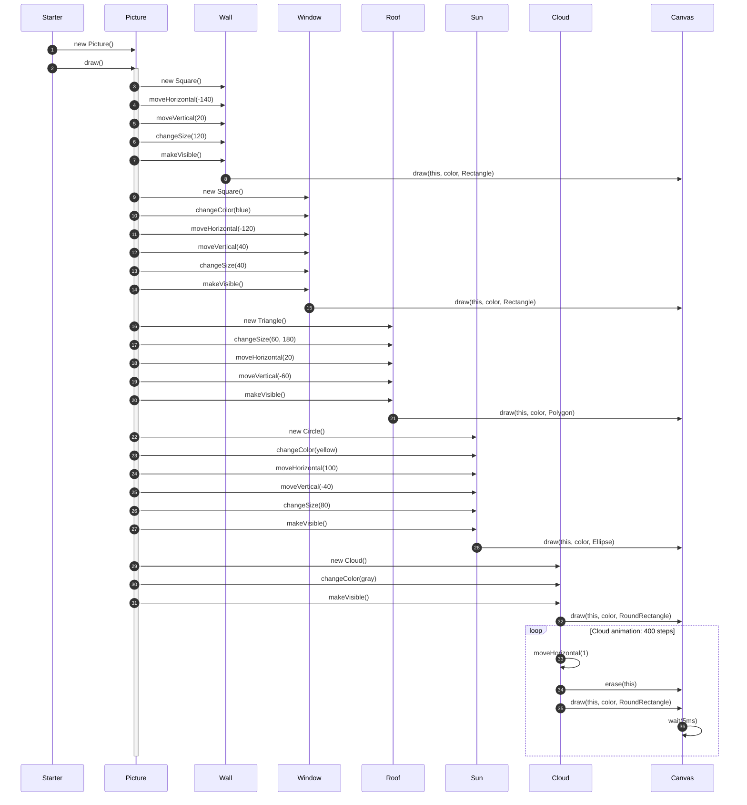

# Sequenzdiagramm — Use Case: `Starter` zeichnet das Bild (V2)

Use-Case: Der Benutzer (über `Starter.main`) initialisiert das Bild und ruft `draw()` auf. Das Diagramm zeigt die Objekterzeugung und die Reihenfolge der Methodenaufrufe (inkl. Zeichen-/Erase-Delegation an `Canvas`).

